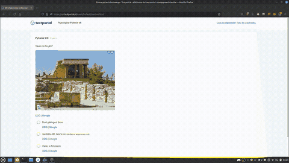

# [PL] TestPortal MultiTool

Sup ladies, my name is [Slim Shady.](https://mrcyjanek.net/) And I'm responsible for this shit.

## Downloads

| Build Status | Firefox Addon | UserScript |
| ------------ | ------------- | ---------- |
|  | <!----> Soon! |  |

Straight to the point, what can this thing do?

|    |      |   |
| -- |------| - |
| ✅ | Bypass _Uczciwy Rozwiązujący_ technology. You can now watch your favourite movie while doing the test! |  |
| ✅ | Quick search function to instantly DuckDuckGo or Google questions/answers. |  |
| ✅ | Bypass per-question time limit |  |
| ✅ | Reverse image search in Google! All you need to do is to click on an image. |  |

# So, how do I install it?

 - Add [Tampermonkey](https://www.tampermonkey.net/) extension.
 - Click on the new icon that appeared in the browser bar, then click on `Control Panel`.
 - Go to `Tools`
 - Paste [`https://git.mrcyjanek.net/mrcyjanek/testportal-multitool/raw/branch/main/script.js`](https://git.mrcyjanek.net/mrcyjanek/testportal-multitool/raw/branch/main/script.js) into `Install From URL` and click Install.
 - Done!

Good luck, in case of problems [hit me up](https://mrcyjanek.net), or join my [discord](https://discord.gg/KhMuN7tJfF)

-------------------------------------------------
Icons made by [Freepik](https://www.freepik.com) from [www.flaticon.com](https://www.flaticon.com/)
