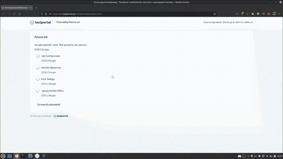
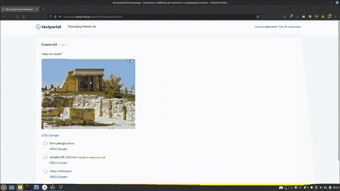

# [PL] TestPortal MultiTool

Siema mordy, to jest mój dodatek, a [to jestem ja.](https://mrcyjanek.net/) Dziękuje za zainteresowanie.

## Pobierańsko

| Build Status | Firefox Addon | UserScript |
| ------------ | ------------- | ---------- |
|  | <!----> Soon! |  |

Bez zbędnych pierdól - co to umie?

|    |      |   |
| -- |------| - |
| ✅ | Omijanie technologii _Uczciwy Rozwiązujący_ Możesz oglądać swój ulubiony film gdy piszesz sprawdzian! |  |
| ✅ | Szukanie informacji w KaczakaKaczkaIdź i Google |  |
| ✅ | Omijanie limiitu czasu na pytanie |  |
| ✅ | Szukanie obrazków w Google. Wystarczy, że klikniesz na obrazek! |  |

# Tak więc, jak to zainstalować?

 - Instalujemy [Tampermonkey](https://www.tampermonkey.net/)
 - Klikamy w ikonkę, która się pojawiła w pasku i wchodzimy w `Panel Sterowania`
 - Idziemy do zakładki `Narzędzia`
 - Wklejamy [`https://git.mrcyjanek.net/mrcyjanek/testportal-multitool/raw/branch/main/script.js`](https://git.mrcyjanek.net/mrcyjanek/testportal-multitool/raw/branch/main/script.js) w miejsce `Install From URL` i klikamy Zainstaluj.
 - Gotowe!

Powodzenia, i jak coś to [pisz](https://mrcyjanek.net), lub wpadaj na [discorda](https://discord.gg/KhMuN7tJfF)

-------------------------------------------------
Icons made by [Freepik](https://www.freepik.com) from [www.flaticon.com](https://www.flaticon.com/)
