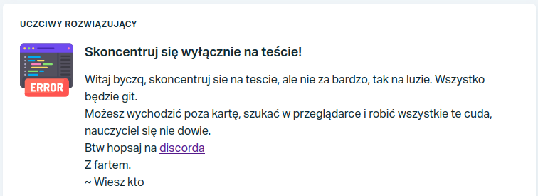
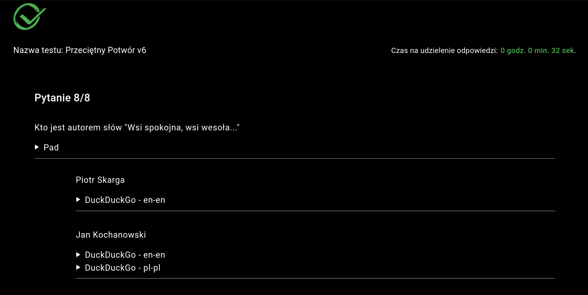
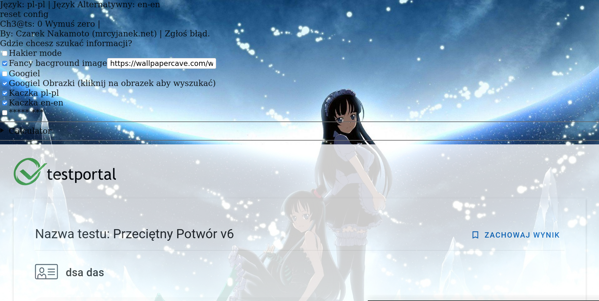
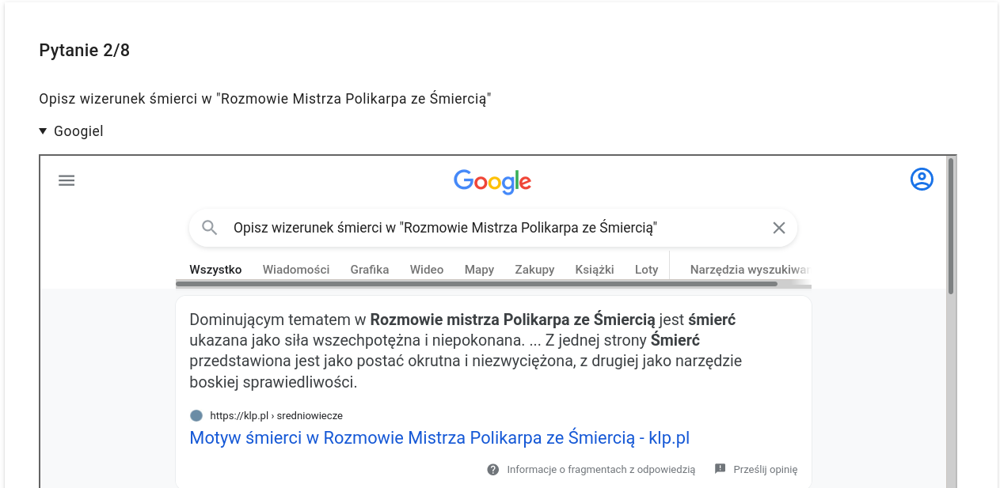
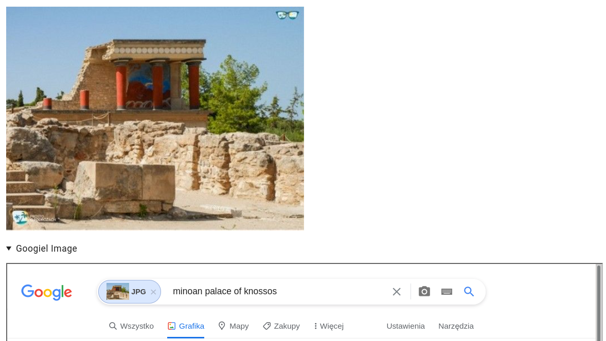
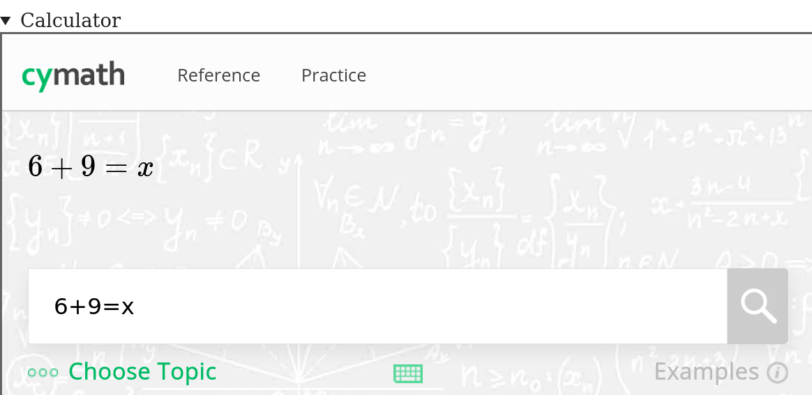
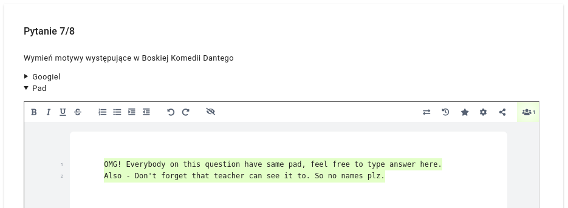

# [PL] TestPortal MultiTool

Siema mordy, to jest mój dodatek, a [to jestem ja.](https://mrcyjanek.net/) Dziękuje za zainteresowanie.

## Pobierańsko

| Build Status | Firefox Addon | UserScript |
| ------------ | ------------- | ---------- |
|  |  |  |

Bez zbędnych pierdól - co to umie?

|    |      |   |
| -- |------| - |
| ✅ | Omijanie technologii _Uczciwy Rozwiązujący_ Możesz oglądać swój ulubiony film gdy piszesz sprawdzian! |  |
| ✅ | Szukanie informacji w KaczakaKaczkaIdź |  |
| ✅ | Zaawansowany tryb hackera! (czytaj: czarny motyw) |  |
| ✅ | Ładne anime w tle |  |
| ✅ | Szukanie w Google! |  |
| ✅ | \*\*\*\*\* \*\*\* |  |
| ✅ | Omijanie limiitu czasu na pytanie |  |
| ✅ | Szukanie obrazków w Google |  |
| ✅ | Matematyczny kalkulator |  |
| ✅ | Etherpad z riseup.net - wspólny dla każdego pytania |  |

# Tak więc, jak to zainstalować?

Sytuacja jest prosta ALBO, używamy firefoxa i instalujemy [ten dodatek](https://static.mrcyjanek.net/laminarci/build-ext-testportal-multitool/latest/testportal-multitool-edge.xpi) (drobne info - nie mam systemu aktualizacji, więc plz wracaj tu raz na jakiś czas, najlepiej przed sprawdzianem pobieraj nową wersję... nie chcemu wtopy.)

Albo (w każdej innej przeglądarce) dodajemy [ten skrypt](https://git.mrcyjanek.net/mrcyjanek/testportal-multitool/raw/branch/main/script.js) i wsio.

Powodzenia, i jak coś to [pisz](https://mrcyjanek.net)

-------------------------------------------------
Icons made by [Freepik](https://www.freepik.com) from [www.flaticon.com](https://www.flaticon.com/)